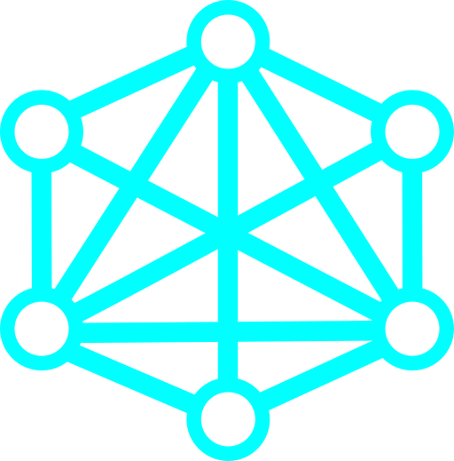
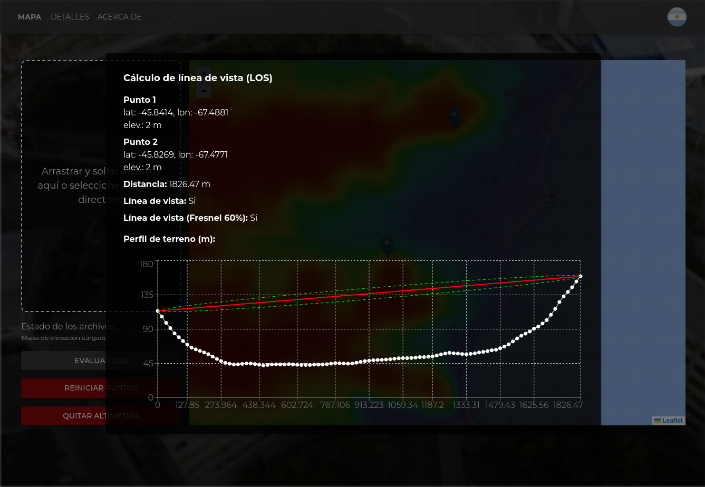

# Veradynium 



## LoRaWAN gateways placement problem: solver and network analysis

This project provides a set of programs and utilities to design and analyze LoRaWAN deployments with energy and terrain elevation (topography) considerations. The [solver](solver) contains a set of tools to compute the optimal placement of the gateways based on end-devices locations and the terrain elevation map, allowing the user to choose between solutions that prioritizes energy consumption or number of gateways to place.

A Python [API](server) is provided to expose the set of programs and access them via HTTP. It also allows to upload terrain elevation files (.csv or .nc) and network configuration (.geojson).

The [GUI](GUI) was implemented with React.js, MUI and Leaflet.js, between other libraries. It allows to upload files of terrain elevation and network topology. LocalStorage is used to store metadata of uploaded files, so they are fetched from the server on app load. Once the files are uploaded, the user can run the solver to compute the optimal placement of gateways, and visualize the results on the map. The GUI also allows to compute the line of sight between two points on the map, and visualize the connections between end-devices and gateways once computed in the backend.

## Installation
Run ```build.sh``` or ```make all``` to set up the project.  

### System Requirements

- **C++17 compliant compiler** (GCC ≥ 7, Clang ≥ 5, MSVC ≥ 2017)  
- **Python 3.10 or later**  
- **pip** ≥ 25  
- **Node.js** ≥ 24  
- **npm** ≥ 11  

## Step-by-step compilation

### Binaries
Compile executables  
```bash
cd solver
make
```
This will build the following programs:  
* ```solver``` -> computes the optimal placement for the gateways from the network topology (specified by a geojson file) and the terrain elevation data (stores in a csv file).  
* ```eval``` -> connects every end device of the network to their nearest gateway, if in range and line of sight.  
* ```los``` -> given two points and the terrain elevation data, it determines if they are in line of sight.  

#### Examples

Manuals can be found using the ```-h``` flag. They are also available in the [solver/assets](solver/assets) folder. After compiling the binaries, these files are moved to the ```solver/bin/assets``` folder.
```bash
Run the solver to compute the optimal placement of gateways and print the result using json format:  
```bash
solver -f elevation.csv -g network.json -o json  
```
Test end-devices to gateways allocation given elevation map and nodes location:  
```bash
eval -f elevation.csv -g network.json -o json
```
Check if two points are in line of sight (LOS) given the elevation map:  
```bash
los -f elevation.csv -p1 36.733780 -91.237743 2.0 -p2 36.712818 -91.221097 2.5
```


### GUI
The GUI runs in the browser. It displays the map with the heatmap of the terrain elevation (once uploaded in ```.csv``` of ```.nc``` format) and the locations of end devices and gateways (once loaded ```.geojson``` format). The terrain elevation and network topology can be previewed in offline mode, this is, without a running backend.    
It allows to compute the line of sight between two selected points on the map, and visualize the connections between these nodes, once computed in the backend.  

Build GUI
```bash
cd gui
npm install
npm run dev # Optional, to run development version
npm run build # Target is ../server/static
```

### Server
Install and start the server for the API  
```bash
cd server
virtualenv venv
source venv/bin/activate
pip3 install -r requirements.txt
uvicorn main:app --reload 
deactivate
```
The GUI will be available at ```localhost:8080``` or ```localhost:5173``` (depending on configuration, if previously compiled).  