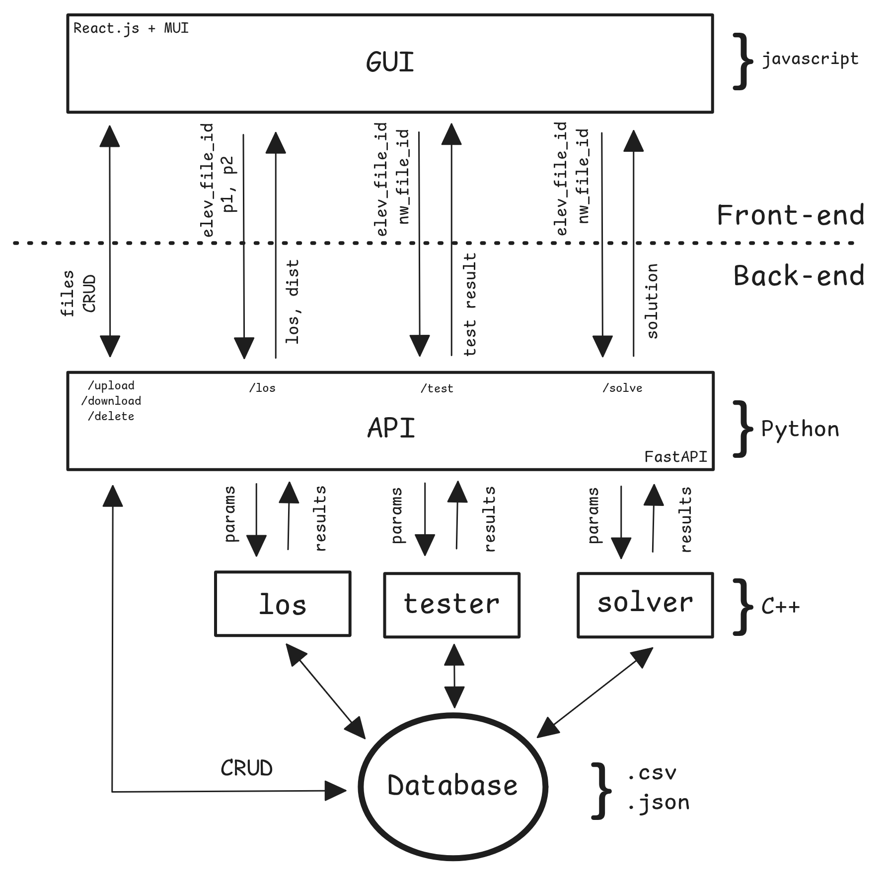

# Veradynium 


## LoRaWAN gateways placement problem: solver and network analysis

This project provides a set of programs and utilities to design and analyze LoRaWAN deployments with energy and terrain elevation (topography) considerations. The [solver](solver) folder contains a set of tools to compute the optimal placement of the gateways based on end-devices locations and the terrain elevation map, allowing the user to choose between solutions that prioritizes energy consumption or number of gateways to place.

A Python [API](server) is provided to expose the set of programs and access them via HTTP. It also allows to upload terrain elevation files (.csv or .nc) and network configuration (.geojson).

The [GUI](GUI) was implemented with React.js, MUI and Leaflet.js, between other libraries. It allows to upload files of terrain elevation and network topology. LocalStorage is used to store metadata of uploaded files, so they are fetched from the server on app load. Once the files are uploaded, the user can run the solver to compute the optimal placement of gateways, and visualize the results on the map. The GUI also allows to compute the line of sight between two points on the map, and visualize the connections between end-devices and gateways once computed in the backend.

## Requirements

### Functional Requirements

#### Backend (C++ binaries)

* Line-of-Sight computation (los)  
 - Must accept a CSV terrain elevation map and coordinates of two locations (with relative altitude).  
 - Must calculate line-of-sight considering the Fresnel zone.  
 - Must return results in plain text or JSON format.  

* Network link testing (test)  
 - Must accept a CSV terrain elevation file and a GeoJSON network topology file.  
 - Must compute links between end-devices and gateways based on line-of-sight and distance.  
 - Must assign each end-device to the closest reachable gateway.  

* Gateway placement optimization (solver)  
 - Must accept a CSV terrain elevation file and a GeoJSON network topology file.  
 - Must compute optimal gateway placement to:  
   - Minimize the number of gateways.  
   - Guarantee total coverage of the network.  
   - Minimize link distances to reduce node power consumption.  

#### API (FastAPI)  
 - Must expose endpoints to upload terrain elevation and network topology files.  
 - Must assign a file_id to each uploaded file and make it retrievable.  
 - Must expose one endpoint per backend binary (los, test, solver) to execute computations with given parameters.  
 - Must allow download and removal of previously uploaded files.  

#### GUI (React + Leaflet)
 - Must allow uploading of terrain maps in CSV or NetCDF (.nc) format (with server-side conversion of .nc to CSV).  
 - Must persist uploaded files in server and store file metadata (file_id) in browser localStorage for reload recovery.  
 - Must display maps using Leaflet with OpenStreetMap tiles and overlay the terrain elevation as a heatmap.  
 - Must allow placing two markers to:  
   - Compute line-of-sight.  
   - Show distance between points (haversine and equirectangular).  
   - Visualize terrain profile, line of sight, and Fresnel zone.  
 - Must allow uploading of a network definition (GeoJSON FeatureCollection with gateway/end-device properties).  
 - Must display nodes on the map with identifiers visible on hover.  
 - Must compute and visualize network connectivity based on line-of-sight and maximum distance constraints.  
 - Must display deployment statistics: coverage, power consumption, infrastructure costs.  
 - Must allow running the gateway optimization (via solver) and display optimal placements and statistics.  

### Non-Functional Requirements

#### Performance

* Computations (LOS, test, solver) must finish within acceptable time for interactive use (<30s typical input).  
* API must handle concurrent requests from multiple users.  

#### Scalability
* System must allow deployment in containerized environments (Docker) for horizontal scaling.  
* Storage must handle growth in number of uploaded files without degradation.  

#### Reliability
* Uploaded files must persist during a server session and be retrievable using file_id.  
* GUI must restore state after browser reload using localStorage metadata.  

#### Usability
* GUI must be intuitive, with map-based visualization of terrain, nodes, and connections.  
* Hover and click interactions must reveal key information (node IDs, distances, etc.).  

#### Maintainability
* Codebase must be modular: separate components for GUI, API, and binaries.  
* Backend binaries must remain independent to allow replacement or reimplementation.  

#### Portability
* Must run on Linux-based servers.  
* Must support containerized deployment (Docker) for cloud platforms (AWS, Azure, Render).  

#### Security
* Only authenticated users (if access control is added later) may upload, download, or delete files.  
* API must validate uploaded files to prevent malicious inputs.  

#### Data Integrity
* Uploaded files must not be modified by the system except for explicit conversion (.nc → .csv).  
* Computation results must be reproducible given the same input files.  

#### Extensibility
* API must allow future addition of new computational backends without breaking existing endpoints.  
* GUI must allow integration of new visualization layers.  

## System's block diagram


## Installation
Run ```build.sh``` or ```make all``` to set up the project.  

### System Requirements

- **C++17 compliant compiler** (GCC ≥ 7, Clang ≥ 5, MSVC ≥ 2017)  
- **Python 3.10 or later**  
- **pip** ≥ 25  
- **Node.js** ≥ 24  
- **npm** ≥ 11  

## Step-by-step compilation

### Binaries
Compile executables  
```bash
cd solver
make
```
This will build the following programs:  
* ```solver``` -> computes the optimal placement for the gateways from the network topology (specified by a geojson file) and the terrain elevation data (stores in a csv file).  
* ```eval``` -> connects every end device of the network to their nearest gateway, if in range and line of sight.  
* ```los``` -> given two points and the terrain elevation data, it determines if they are in line of sight.  

#### Examples

Manuals can be found using the ```-h``` flag. They are also available in the [solver/assets](solver/assets) folder. After compiling the binaries, these files are moved to the ```solver/bin/assets``` folder.
```bash
Run the solver to compute the optimal placement of gateways and print the result using json format:  
```bash
solver -f elevation.csv -g network.json -o json  
```
Test end-devices to gateways allocation given elevation map and nodes location:  
```bash
eval -f elevation.csv -g network.json -o json
```
Check if two points are in line of sight (LOS) given the elevation map:  
```bash
los -f elevation.csv -p1 36.733780 -91.237743 2.0 -p2 36.712818 -91.221097 2.5
```


### GUI
The GUI runs in the browser. It displays the map with the heatmap of the terrain elevation (once uploaded in ```.csv``` of ```.nc``` format) and the locations of end devices and gateways (once loaded ```.geojson``` format). The terrain elevation and network topology can be previewed in offline mode, this is, without a running backend.    
It allows to compute the line of sight between two selected points on the map, and visualize the connections between these nodes, once computed in the backend.  

Build GUI
```bash
cd gui
npm install
npm run dev # Optional, to run development version
npm run build # Target is ../server/static
```

### Server
Install and start the server for the API  
```bash
cd server
virtualenv venv
source venv/bin/activate
pip3 install -r requirements.txt
uvicorn main:app --reload 
deactivate
```
The GUI will be available at ```localhost:8080``` or ```localhost:5173``` (depending on configuration, if previously compiled).  